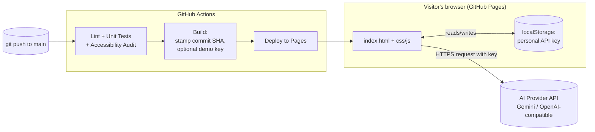

# 🏟️ Stadium Companion — FIFA World Cup 2026

<p align="center">
  
</p>

<p>
  
  
  
  
  
</p>

A GenAI-powered assistant for fans, organizers, volunteers, and venue staff — built to run entirely as a **free static site on GitHub Pages**, deployed by a **single GitHub Actions workflow**.

**[▶ Live demo](https://code-paul-creator.github.io/stadiumgenie-ai/)**

> Fan-made demo project. Not affiliated with or endorsed by FIFA.

---

## Contents

- [What it does](#what-it-does)
- [Screenshots](#screenshots)
- [How it maps to the brief](#how-it-maps-to-the-brief)
- [Architecture](#architecture)
- [Quick start — deploy your own copy in 3 steps](#quick-start--deploy-your-own-copy-in-3-steps)
- [Add your API key](#add-your-api-key)
- [Run it locally](#run-it-locally)
- [Testing & code quality](#testing--code-quality)
- [Accessibility](#accessibility)
- [Security model](#security-model)
- [Project structure](#project-structure)
- [Troubleshooting](#troubleshooting)
- [License](#license)

---

## What it does

<details open>
<summary><strong>🧭 Navigate</strong> — plain-language walking directions between any gate and any point of interest</summary>
<br>

Pick a starting gate and a destination in free text ("Section 112", "the nearest family restroom"). The AI turns the stadium's gate layout into a short, numbered walking guide. Works offline too — a clear static fallback shows even without an API key.
</details>

<details>
<summary><strong>👥 Crowd Watch</strong> — real-time-style congestion levels + AI situation summaries</summary>
<br>

Zones are ranked by occupancy percentage and color-coded (low → critical). One click asks the AI to turn the raw numbers into a short summary with concrete recommended actions ("open overflow Gate D", "add stewards to Concessions Row 1") for organizers and volunteers.
</details>

<details>
<summary><strong>♿ Accessibility</strong> — standard features list + a concierge for specific questions</summary>
<br>

Always-available static list of accessibility features (wheelchair seating, sensory-friendly rooms, interpretation on request, etc.) plus a free-text concierge for situation-specific questions.
</details>

<details>
<summary><strong>🚌 Transport</strong> — per-stadium transit options</summary>
<br>

Rail, metro, shuttle, bike valet, and rideshare zones specific to the selected venue.
</details>

<details>
<summary><strong>🌱 Sustainability</strong> — CO2e savings estimator + AI tips</summary>
<br>

Enter your distance and transport mode; get an instant, deterministic CO2e-saved estimate (no AI needed) plus optional AI-generated, city-specific sustainability tips.
</details>

<details>
<summary><strong>🌐 Multilingual assistance</strong> — 8 languages, with AI translation for free text</summary>
<br>

The whole interface ships in English, Spanish, French, Portuguese, Arabic (RTL), German, Japanese, and Hindi. Anything typed by a fan or volunteer can also be AI-translated on demand.
</details>

<details>
<summary><strong>💬 Ask Anything</strong> — general fan assistant chat</summary>
<br>

A conversational assistant for open-ended matchday questions, stadium-context-aware.
</details>

<details>
<summary><strong>📋 Ops Console</strong> — one-click shift digest for organizers/volunteers</summary>
<br>

Generates a shareable operational summary combining crowd data into a handoff-ready digest.
</details>

## Screenshots

<details open>
<summary><strong>🖼️ Click to expand / collapse the gallery</strong></summary>
<br>

| | |
|---|---|
| **Overview** — scoreboard header, gate-numbered nav | **Navigate** — gate-to-gate walking guide |
|  |  |
| **Crowd Watch** — ranked, color-coded occupancy | **Accessibility** — static features + concierge |
|  |  |
| **Transport** — per-stadium transit options | **Sustainability** — CO2e estimator |
|  |  |
| **Ask Anything** — general fan chat assistant | **Ops Console** — volunteer/organizer digest |
|  |  |
| **العربية (RTL)** — full right-to-left layout | **Mobile** — 390px viewport |
|  |  |

</details>

## How it maps to the brief

| Requirement | Where it lives |
|---|---|
| Navigation | `panel-navigate`, `js/navigation.js` |
| Crowd management | `panel-crowd`, `js/crowd.js` |
| Accessibility | `panel-access`, `js/accessibility.js` |
| Transportation | `panel-transport` |
| Sustainability | `panel-sustain`, `js/sustainability.js` |
| Multilingual assistance | `js/i18n.js` (8 languages + AI translation) |
| Operational intelligence | `panel-ops` |
| Real-time decision support | `panel-crowd` AI situation summaries |

## Architecture



No server, no database, no backend proxy — the browser talks directly to the AI provider's official API. That's what makes free GitHub Pages hosting possible.

---

## Testing & code quality

```bash
npm test        # Jest: 40+ unit tests covering utils, i18n, and data integrity
npm run lint     # ESLint: no-undef, eqeqeq, no-var, prefer-const
```

Every push and pull request runs, in order: **lint → unit tests → accessibility audit (pa11y, WCAG2AA) → build → deploy**. The deploy step only runs on `main` and only after everything else passes.

The included tests cover:
- Pure logic in `js/utils.js` (occupancy math, congestion classification, CO2e estimates, input sanitization)
- Data integrity for `data/stadiums.json` and `data/crowd-feed.json` (required fields, unique ids, valid ranges)
- Translation completeness — every language must define the same set of UI keys as English

## Accessibility

- Semantic landmarks, a skip-to-content link, and a proper `tablist`/`tabpanel` structure with arrow-key navigation
- Visible keyboard focus rings everywhere (`:focus-visible`)
- `aria-live` regions for AI responses and status announcements
- `prefers-reduced-motion` respected
- RTL layout support for Arabic
- Automated WCAG2AA audit (`pa11y`) on every CI run

## Security model

- **No secret is committed to the repo.** `js/config.js` only holds a placeholder (`__DEMO_API_KEY__`) that the deploy workflow substitutes at build time, straight from the `GEMINI_API_KEY` Actions secret — the raw key is never written into version control.
- **The key still ends up in the deployed static files**, because that's unavoidable for a client-side call from a Pages site. The mitigation is a **referrer-restricted, quota-limited key** (see [Add your API key](#add-your-api-key)) — restrict it to your `github.io` domain so it's useless if copied elsewhere.
- A `Content-Security-Policy` meta tag restricts network requests to the site's own origin plus the two supported AI provider endpoints.
- User-supplied text is length-clamped before being sent to the AI, and any AI/user text rendered as HTML is escaped (`js/utils.js#sanitizeForDisplay`).
- Dependencies are dev-only (`eslint`, `jest`) — the shipped site has **zero runtime dependencies**.

## Project structure

```
.
├── .github/workflows/deploy.yml   # lint → test → a11y audit → build → deploy
├── index.html                      # single-page app shell
├── css/styles.css
├── js/
│   ├── config.js                   # non-secret defaults (safe to commit)
│   ├── utils.js                    # pure logic (unit-tested)
│   ├── api.js                      # provider-agnostic GenAI wrapper
│   ├── i18n.js                     # 8-language UI strings + AI translation
│   ├── navigation.js
│   ├── crowd.js
│   ├── accessibility.js
│   ├── sustainability.js
│   └── app.js                      # DOM wiring / controller
├── data/                           # static demo data (stadiums, crowd feed)
├── assets/favicon.svg              # shipped to the live site
├── docs/readme-assets/             # README-only images (banner, screenshots)
│                                    # — NOT copied to the deployed site
├── tests/                          # Jest unit + data-integrity tests
├── eslint.config.js
└── package.json
```

## Troubleshooting

| Symptom | Fix |
|---|---|
| "No API key configured yet" shows in the AI panels | Add the `GEMINI_API_KEY` repo secret (see [Add your API key](#add-your-api-key)) and re-run the deploy workflow |
| Provider error / 4xx in the result box | Check the key is valid and its referrer restriction includes your exact `github.io` URL |
| Pages shows a 404 | Confirm **Settings → Pages → Source** is set to **GitHub Actions**, and that the workflow finished successfully under the **Actions** tab |
| Workflow fails on the accessibility audit step | Click into the failed step's log — `pa11y` prints the exact element and WCAG rule that failed |

## License

MIT — see [LICENSE](LICENSE).
